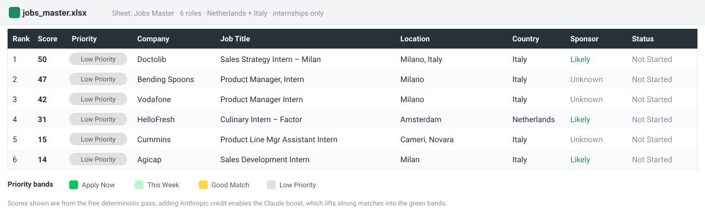
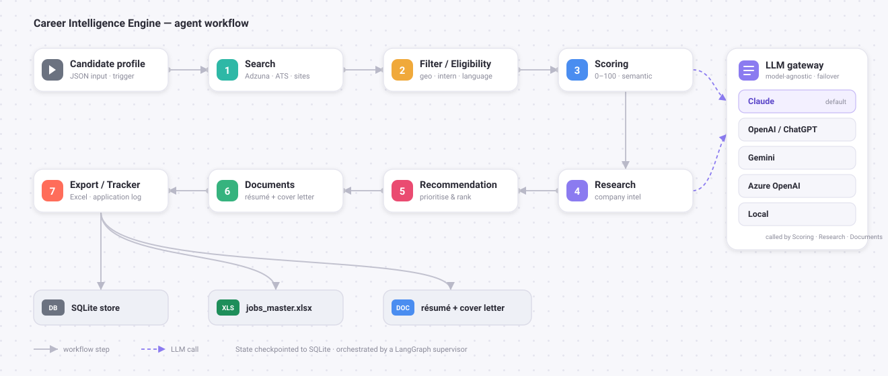
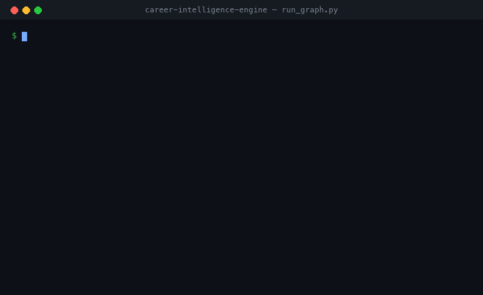
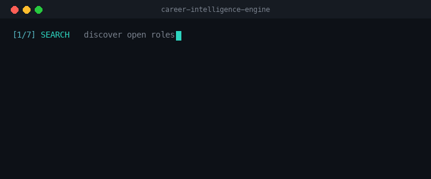
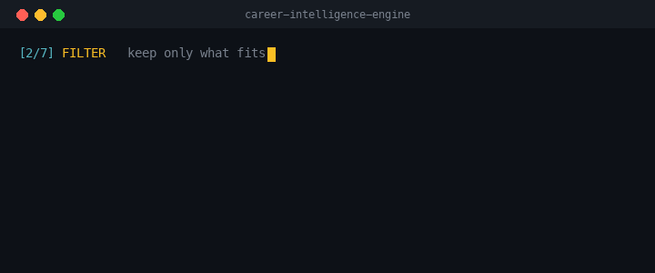
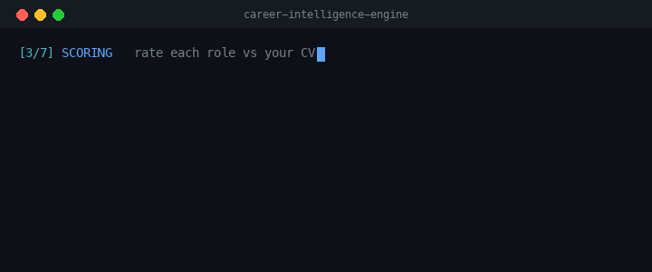
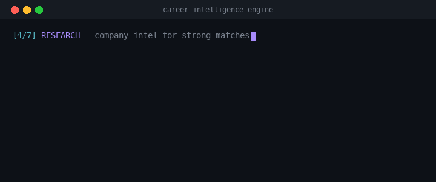
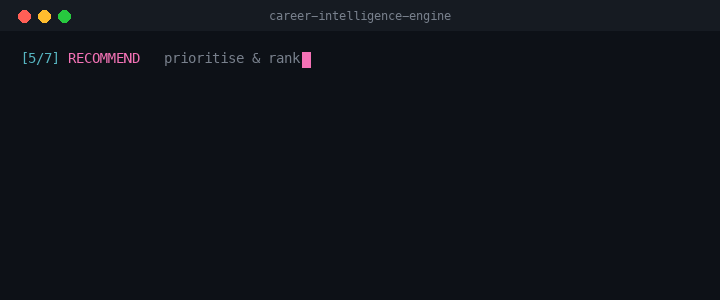
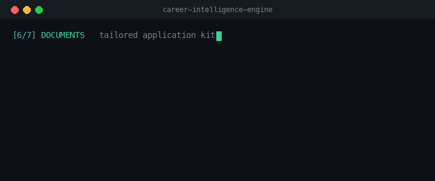
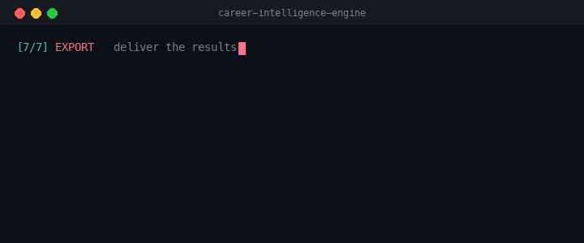

# Career Intelligence Engine

[](https://github.com/Darpan00720/career-intelligence-engine/actions/workflows/ci.yml)


[](LICENSE)

A multi-agent job-search assistant I built to run my own internship hunt.

I'm an MBA candidate looking for product, strategy, and AI roles across the
**Netherlands and Italy**. Doing that search by hand meant refreshing the same job
boards, re-reading the same descriptions, and pasting details into a spreadsheet I
never kept up to date. So I automated the loop: this project goes out and finds the
openings, drops the ones I'm not actually eligible for, scores what's left against
my CV, and drafts a first-pass résumé and cover letter for the strongest matches.

It started as a weekend script and grew into a proper **multi-agent system** —
seven specialized agents, coordinated by a supervisor, each owning one part of the
search — with a real test suite and an API. I still use it, so I keep improving it.

> **Try it in 10 seconds, no setup:** `python3 run_graph.py --demo` runs the whole
> pipeline on bundled sample jobs — no API keys, no credits. See [the demo](#try-it-in-10-seconds-no-keys-needed).

## Contents

- [What it does](#what-it-actually-does) · [What the output looks like](#what-the-output-looks-like)
- [The seven agents](#the-seven-agents) · [Architecture](#architecture) · [See it run](#see-it-run)
- [The filters](#the-filters-that-matter-and-why) · [Tech stack](#tech-stack) · [Models / LLMs](#models-llms)
- [Run it yourself](#run-it-yourself) · [10-second demo](#try-it-in-10-seconds-no-keys-needed) · [API](#theres-also-an-api)
- [Honest limitations](#honest-limitations) · [Project layout](#project-layout)

---

## What it actually does

Give it your profile — a JSON file with your background, target roles, and
locations — and run one command. It will:

1. **Find roles** across many sources: the [Adzuna](https://developer.adzuna.com/)
   API plus companies' own hiring APIs (Greenhouse, Lever, Ashby, SmartRecruiters)
   and career-page feeds. No scraping, no paid scraper services.
2. **Filter hard, and early.** Before anything expensive runs, it throws out roles
   that are outside my target countries, aren't actually internships/graduate
   programs, or require a language I don't speak — *"fluent Italian required"* is
   dropped, while *"Italian is a plus"* is kept.
3. **Score the survivors** against my CV: a transparent 0–100 score built from role
   fit, skills overlap (semantic, not just keyword matching), location, and
   seniority — with an optional Claude adjustment for the nuance a rules engine
   misses.
4. **Hand me the results**: a ranked Excel dashboard of every match, and for the
   roles that clear the bar, an auto-drafted résumé and cover letter tailored to
   that specific company.

Every score is explainable — it comes with the reasons behind it, so I know *why* a
role ranked where it did instead of staring at a black-box number.

## What the output looks like

The headline deliverable is `outputs/jobs_master.xlsx` — every match, ranked and
colour-coded by application priority, with the eligibility fields that matter
(country, work mode, visa sponsorship). Below is an illustrative example spanning
**both target markets — the Netherlands and Italy** — internships only, ranked from
top matches (green *Apply Now*) down to weaker ones:



---

## The seven agents

It's a multi-agent system. A LangGraph **supervisor** routes work through seven
specialized agents, each responsible for one slice of the search:

| # | Agent | What it does |
|---|---|---|
| 1 | **Search** | Pulls openings from Adzuna + company ATS APIs (Greenhouse / Lever / Ashby / SmartRecruiters) + career-page feeds |
| 2 | **Filter / Eligibility** | Drops roles outside my countries, non-internship roles, and anything that requires a language I don't speak |
| 3 | **Scoring** | Rates each role 0–100 — role fit, semantic skills match, location, seniority — with an optional LLM adjustment |
| 4 | **Research** | Gathers company context for the strong matches |
| 5 | **Recommendation** | Prioritizes and ranks what's actually worth applying to |
| 6 | **Documents** | Drafts a tailored résumé + cover letter |
| 7 | **Export / Tracker** | Writes the ranked Excel dashboard and logs applications |

The whole run is a LangGraph workflow with its state checkpointed to SQLite, so it
can pause and resume without redoing work. (Two more agents — analytics and
notifications — handle reporting and delivery.)

## Architecture

The profile enters a LangGraph supervisor that routes it through the seven agents;
scoring, research, and document drafting call out to the LLM gateway.



### See it run

One command — `python3 run_graph.py` — runs the whole thing end to end: it searches,
filters to the Netherlands and Italy, scores every role against the CV, drafts
documents for the strong matches, and writes the ranked dashboard. From the prompt
to the output:



<details>
<summary><b>▶ Watch each of the seven stages on its own</b> (7 short clips)</summary>

<br>

**1 · Search** — pull open roles from Adzuna + the ATS APIs + career-site feeds



**2 · Filter / Eligibility** — drop everything outside the geography, seniority, and language rules



**3 · Scoring** — rate every survivor 0–100 against the CV (semantic + deterministic)



**4 · Research** — gather company intel for the strong matches



**5 · Recommendation** — prioritise and rank what to apply to



**6 · Documents** — draft a tailored résumé + cover letter per top match



**7 · Export / Tracker** — write the ranked `jobs_master.xlsx` and update the tracker



</details>

---

## The filters that matter (and why)

These are the rules that keep the list relevant to *me*. All of them are
configurable via environment variables, so you can point it at your own search:

- **Netherlands + Italy only** (`GEO_COUNTRIES=it,nl`) — my two target markets.
  Leave it empty for Europe-wide.
- **Internships & graduate programs only** (`INTERN_ONLY=1`) — senior, lead, and
  director roles are filtered out.
- **English-sufficient roles only** — a role that *requires* a non-English language
  is rejected; a language listed as a *plus* or *preference* is fine. The check
  reads the actual job description (it even handles requirements buried in HTML).

---

## Tech stack

| Area | What I used |
|---|---|
| Language | Python |
| Agent orchestration | LangGraph |
| LLMs | Claude (default) · OpenAI / ChatGPT · Gemini · Azure · local — via a provider gateway |
| Semantic matching | Sentence Transformers (`all-MiniLM-L6-v2`) |
| API | FastAPI |
| Storage | SQLite |
| Documents | python-docx (résumé + cover letter) |
| Spreadsheets | openpyxl |
| Tests | pytest (1,200+ tests) |
| Packaging | Docker / Docker Compose |

---

## Models (LLMs)

The pipeline runs on **Anthropic Claude** by default — it handles the scoring
adjustment, company research, and the résumé / cover-letter drafting.

It isn't locked to one vendor, though. The LLM layer is a **provider-agnostic
gateway** with adapters for **OpenAI (ChatGPT)**, **Azure OpenAI**, **Google
Gemini**, and a **local** model, behind cost- and latency-aware routing with
automatic failover. Switch with the `MODEL_PROVIDER` setting; if a provider is down
or over budget, the router falls back to the next healthy one and keeps going.

---

## Run it yourself

```bash
git clone https://github.com/Darpan00720/career-intelligence-engine.git
cd career-intelligence-engine
pip install -r requirements.txt
```

### Try it in 10 seconds (no keys needed)

```bash
python3 run_graph.py --demo
```

Runs the real pipeline on a handful of bundled sample jobs — **no API keys, no
credits, no live search.** It loads eight roles, filters them to the Netherlands +
Italy / internships / English-sufficient, scores them, and writes
`outputs/demo_jobs_master.xlsx`. You'll see exactly which roles are dropped and why
(out-of-geography, not an internship, requires a non-English language). It uses an
isolated `data/demo.db`, so your real database is never touched.

### The full run

Add your keys to a `.env` file (see `.env.example`), then:

```bash
python3 run_graph.py
```

That searches live boards, filters, scores, and writes `outputs/jobs_master.xlsx`
end to end. The richer features — the Claude scoring adjustment, company research,
and the auto-drafted résumé/cover letter — kick in when an Anthropic API key with
credit is present; without it, the deterministic scoring and the Excel still run.

---

## There's also an API

If you'd rather treat it as a service, there's a FastAPI app:

```bash
docker compose up --build
curl http://localhost:8000/health
```

- `/health`, `/ready`, `/version` — always open, handy for monitoring.
- `/api/*` — jobs, recommendations, analytics, and application tracking.
- `/api/v2/*` — a versioned gateway for workflows, experiments, and metrics.

The data endpoints support API-key authentication and per-tenant isolation: set
`API_KEYS` in `.env` and each key is scoped to its own tenant. With no keys set, it
runs in open/dev mode.

---

## Honest limitations

- The Claude-powered pieces (score boost, company research, document drafting) need
  Anthropic API credit. Run without it and you still get search, filtering,
  deterministic scoring, and the Excel — just not the AI-written documents.
- Aggregator listings sometimes arrive with truncated descriptions, so the
  language/eligibility checks can only judge what's actually in the text. When in
  doubt, open the original posting.
- It's tuned to my profile and target markets. The filters are configurable, but
  the role taxonomy reflects product/strategy/AI internships — adapt it for a
  different field.

---

## Project layout

```
agents/    the individual agents (search, scoring, research, documents)
graph/     the LangGraph workflow and nodes
core/      scoring, eligibility, filtering, export — the actual logic
api/        the FastAPI app
services/   application-level services
schemas/    data models
prompts/    the AI prompts, kept as editable text (never hardcoded)
data/       runtime data and dictionaries
tests/      the test suite
docs/       architecture notes and design decisions
```

---

## About

Built by **Darpan Jain** — MBA candidate, focused on AI product management,
digital transformation, and technology strategy.

This is a personal project: I built it to learn and to run my own job search, and
I'm sharing it as part of my portfolio.

## License

Released under the [MIT License](LICENSE) — free to use, study, and build on.
